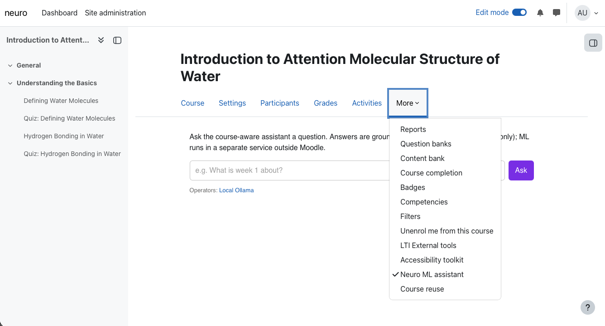
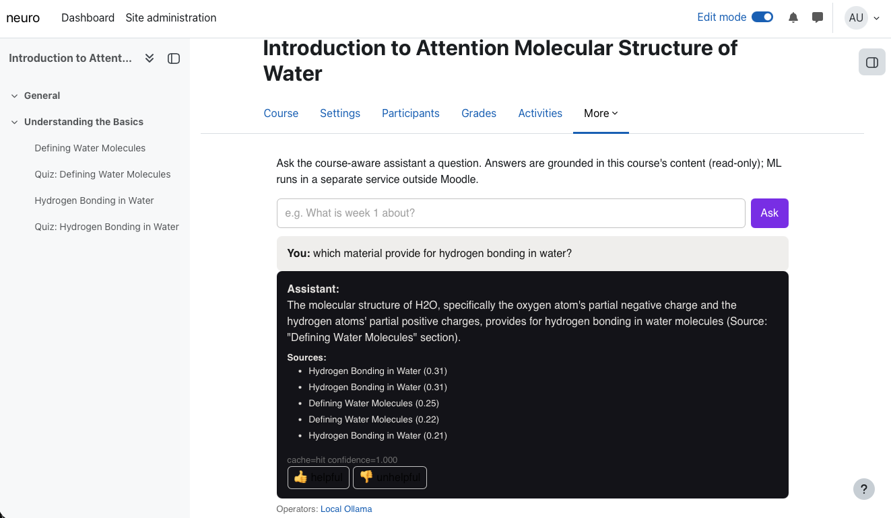
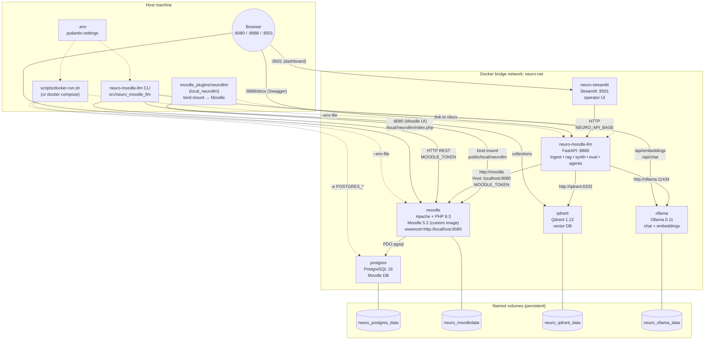
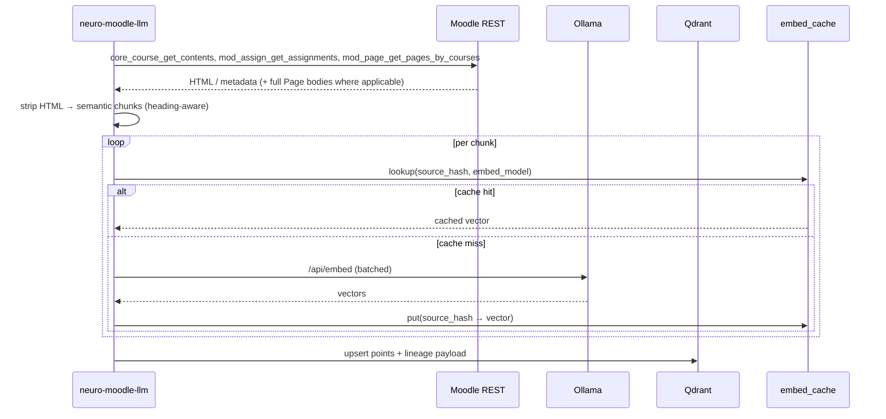
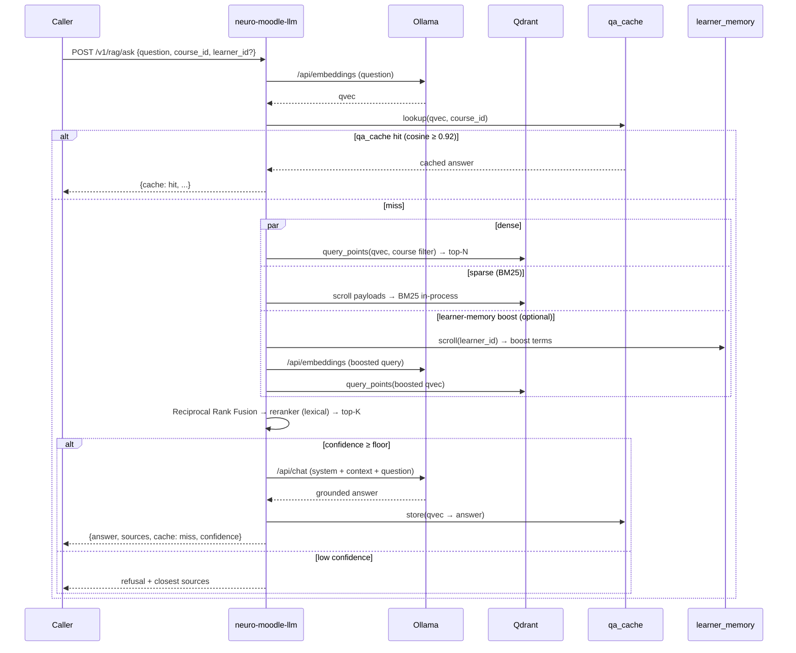

# Neuro-Moodle-LLM

Self-hosted **Moodle 5.2** + **PostgreSQL 16** + **Qdrant** + **Ollama (Llama 3.2)** stack with a
Python integration layer that ingests Moodle course content into Qdrant and answers
course-scoped questions via Ollama (RAG). **ML and RAG run in a separate FastAPI service**
(`neuro-moodle-llm` on port **8888**). Moodle ships the **`local_neurollm`** plugin: in-course chat + settings, **custom web services** for synthetic-course authoring (create course / page / quiz, delete, read quiz attempt), and an **event observer** that POSTs quiz submissions to the API for closed-loop eval.

The Moodle image is **custom-built** from the official tarball
(`moodle-latest-502.tar`) on a pinned `php:8.3.17-apache-bookworm` base.
No third-party Moodle distros are used.

## Screenshots

<p align="center">
  
  
</p>

### Neuro theme (branded hub)

The [Neuro Gaming Lab](https://neurogaminglab.github.io/Neuro-Gaming-Lab/) hub uses a dark “Neuro” palette and paired fonts. This repo mirrors that look in **`docs/`** so you get the same feel outside GitHub’s plain Markdown renderer:

| Token | Value | Use |
|-------|-------|-----|
| Background | `#0a0a0f` | Page |
| Surface | `#12121a` | Cards, code background |
| Text | `#e8e6e3` | Body copy |
| Muted | `#888` | Secondary text |
| Accent | `#7c3aed` | Links, highlights |
| Body font | **Space Grotesk** | Paragraphs, headings |
| Mono font | **JetBrains Mono** | Logo strip, pills, `code` |

- **Local:** open [`docs/index.html`](docs/index.html) in a browser (loads [`docs/neuro-theme.css`](docs/neuro-theme.css) + Google Fonts).
- **GitHub Pages:** enable **Settings → Pages →** Build from **`/docs`** on `main`; the themed landing will be served at your usual `*.github.io/<repo>/` URL.

## Architecture

The system has four planes: **(1)** the Moodle LMS and its database inside Docker,
**(2)** the vector store and local LLM runtime, **(3)** the **Neuro ML API** (FastAPI in Docker),
and **(4)** the **Python CLI** on your host (or any machine that can reach the published ports).
Configuration is read from `.env` for both Compose and the Python package.

### Component diagram

The stack runs as **six containers** on a user-defined bridge network (`neuro-net`) — start
it with either **`docker compose up -d --build`** or **`scripts/docker-run.sh`** (raw
`docker build` + `docker run`, idempotent). Inter-container DNS resolves by service name
(`docker compose` uses names like `neuro-moodle-llm-moodle-1`; `docker-run.sh` uses short names
`moodle`, `postgres`, `neuro-moodle-llm`, `neuro-streamlit`, etc.). Named volumes persist Postgres data, Moodle `moodledata/`, Qdrant storage, and Ollama model
weights. The host browser/CLI hits Moodle, the API, and Streamlit on published ports; the API talks to
Moodle via the in-network hostname and forces the **`Host: localhost:8080`** header so Moodle's
`wwwroot` check doesn't 303-redirect.



**Ports (default, host → container):** Moodle `8080→80`, Neuro ML API `8888→8888`, **Streamlit dashboard `8501→8501`**, Postgres **`5433→5432`** (host `5433` avoids clashes with a local Postgres on `5432`), Qdrant `6333→6333` (HTTP) and `6334→6334` (gRPC), Ollama `11434→11434`.

**API container env overrides** (set in `scripts/docker-run.sh` and `docker-compose.yml`):
`MOODLE_BASE_URL=http://moodle`, `MOODLE_HOST_HEADER=localhost:8080`,
`QDRANT_URL=http://qdrant:6333`, `OLLAMA_HOST=http://ollama:11434`.

### ML API outside Moodle

The **Neuro ML API** (`docker compose` service `neuro-moodle-llm`) exposes OpenAPI at **`http://localhost:8888/docs`**. Inside Compose it overrides `MOODLE_BASE_URL`, `QDRANT_URL`, and `OLLAMA_HOST` to use service names (`http://moodle`, `http://qdrant:6333`, `http://ollama:11434`). The Moodle **core tarball is unchanged**; the **`local_neurollm`** plugin is bind-mounted from `moodle_plugins/neurollm/` into `public/local/neurollm/`. After first deploy, run **Site administration → Notifications** to install it, then set **Local plugins → Neuro Moodle LLM → API base URL** (e.g. `http://localhost:8888`) so the course nav link opens the external docs. For **publish-to-Moodle** and **quiz webhook** flows, also set **webhook base URL** (e.g. `http://neuro-moodle-llm:8888` on the Docker network) and **event secret** to match `NEURO_EVENT_SECRET` on the API. **The API endpoints are not authenticated in this scaffold** — add auth (Moodle token validation, reverse proxy, or mTLS) before production.

### Health checks

- **`GET /health`** — always `200`; returns a JSON report with `moodle`, `qdrant`, and `ollama` each having an `ok` boolean (soft probe; useful for dashboards).
- **`GET /health/strict`** — `200` only when **all three** dependencies report `ok: true`; otherwise **`503`** with the same JSON in `detail`. Use this for readiness gates and CI smoke tests.

### Ollama integration (from the API)

`src/neuro_moodle_llm/ollama.py` (`OllamaClient`) wraps Ollama's HTTP API: **`/api/version`**, **`/api/tags`**, **`/api/pull`**, **`/api/embed`** (batch when available, else per-text), **`/api/embeddings`**, **`/api/chat`** (non-streaming JSON), plus **`warm()`** for a cheap keep-alive hit. Every request uses an httpx timeout from **`OLLAMA_HTTP_TIMEOUT_S`** (default **3600** seconds in `config.py`) so long runs like **`POST /v1/synth/course`** do not fail with `ReadTimeout` on cold model load. If Ollama still exceeds that budget, `/v1/synth/course` returns **`504`** with guidance instead of an opaque `500`.

### Streamlit operator dashboard

The **`streamlit`** service (image `neuro-moodle-llm/streamlit:local`, built from `Dockerfile.streamlit`, source under `streamlit_app/`) is an instructor / ML-ops console layered on top of the FastAPI service — it makes no direct calls to Qdrant / Ollama / Moodle. Open **http://localhost:8501** after `docker compose up -d --build`. Pages include **Home**, **RAG Playground**, **Ingest**, **Eval & Monitor**, **HPO & Registry**, **HITL Feedback**, **Audit**, **Symbolic**, **DPO Export**, **Event Simulator**, and **Synthetic Course** (Ollama course generator with optional **publish to Moodle**, quiz-attempt eval, and purge). State is read from the bind-mounted `./data` directory (also mounted read-write into the API container so eval / registry / monitoring artefacts persist across rebuilds). **Rebuild the Streamlit image** after changing `streamlit_app/` (the Dockerfile `COPY`s sources into the image). Auth is **not** built in — gate `:8501` behind your reverse proxy or basic-auth before exposing.

### Enhancement review → implementation map (how to use each feature)

The dated review [**ml-enhancement-reviews/2026-05-09-neuro-moodle-llm-ml-enhancements.md**](ml-enhancement-reviews/2026-05-09-neuro-moodle-llm-ml-enhancements.md) lists Quick Wins, Strategic improvements, and roadmap phases. The **canonical mapping** from each recommendation to **modules, HTTP routes, CLI commands, env vars, and copy-pastable examples** is maintained in:

**[ml-enhancement-reviews/IMPLEMENTATION-MAP.md](ml-enhancement-reviews/IMPLEMENTATION-MAP.md)**

Use that file when operating or extending the stack; the table below is a **short index** only.

### ML capabilities index (Phase 1 / 2 / 3)

| Area | Capabilities (see IMPLEMENTATION-MAP for usage) |
|------|--------------------------------------------------|
| **Phase 1 — retrieval & quality** | Semantic chunking + lineage (`chunker.py`, `lineage.py`); embedding cache (`embedding_cache.py`); batch embed (`ollama.py`); hybrid BM25 + RRF + lexical rerank (`retrieval.py`, `reranker.py`, `rag.py`); answer cache (`qa_cache.py`); eval harness (`eval.py`, `/v1/eval/run`, `eval` CLI). |
| **Phase 2 — ops & UX** | Event webhook re-ingest (`events.py`, `/v1/events/moodle`); PDF ingest (`multimodal.py`, `/v1/ingest/multimodal/pdf`); HPO grid (`hpo.py`, `/v1/hpo/grid`); monitoring (`monitoring.py`, `/v1/monitor/run`); in-Moodle chat (`moodle_plugins/neurollm/index.php`). |
| **Phase 3 — agents & trust** | Agent pipeline (`agents.py`, `/v1/agents/run`); assignment feedback draft + HITL submit (`feedback.py`, `/v1/agents/feedback/*`); learner memory (`memory.py`); registry (`registry.py`, `/v1/registry`); LinUCB bandit (`bandits.py`); synthetic audit (`synthetic.py`, `/v1/audit/course/{id}`); symbolic checks (`symbolic.py`, `/v1/symbolic/*`); DPO export (`dpo.py`, `/v1/dpo/export`); **synthetic courses** (`synthetic_course.py`, `/v1/synth/course`, `synth-course` CLI — see [docs/SYNTHETIC_COURSES.md](docs/SYNTHETIC_COURSES.md) for the reference and [docs/SYNTHETIC_COURSES_WALKTHROUGH.md](docs/SYNTHETIC_COURSES_WALKTHROUGH.md) for the per-step walkthrough). |
| **Phase 3 — Moodle publish + closed-loop eval (Route A)** | Publish synthetic courses straight into Moodle (Pages + multichoice quizzes) via the `local_neurollm` plugin's `local_neurollm_create_course/_page/_quiz_with_questions/_delete_course/_get_quiz_attempt` external functions (`moodle_authoring.py`, `synthetic_course.publish_to_moodle=true`). Quiz attempts trigger a `\mod_quiz\event\attempt_submitted` observer that webhooks `/v1/events/moodle`; `quiz_eval.evaluate_quiz_attempt` (also exposed as `/v1/eval/quiz_attempt` and `neuro-moodle-llm eval-quiz`) scores agentic citations vs the synthetic `must_cite` and writes `data/monitoring/quiz_eval_<attempt_id>.json`. Cleanup: `/v1/synth/purge` / `neuro-moodle-llm purge-synth`. |

**Settings:** `NEURO_API_CORS_ORIGINS`, `NEURO_EVENT_SECRET`, `NEURO_ENABLE_LEARNER_MEMORY`, `MOODLE_HOST_HEADER`, plus existing `MOODLE_*`, `QDRANT_*`, `OLLAMA_*` (including `OLLAMA_HTTP_TIMEOUT_S` for long Ollama calls such as `/v1/synth/course`; default 3600s in code) (see IMPLEMENTATION-MAP §5).

**Optional pip extras:** `.[math]` (sympy for `/v1/symbolic/math`), `.[hpo]` (Optuna), `.[audio]` (Whisper path). **DPO training** after export: see IMPLEMENTATION-MAP §3 row 7 and README runbook snippet there cross-linked from the map.

### Data flow — ingest (`ingest-course`)

Course structure is pulled via Moodle web services, run through the **heading-aware
semantic chunker** (`chunker.py`), checked against the **embedding cache**
(`embedding_cache.py`) so unchanged chunks skip re-embedding, **batch-embedded** via
Ollama `/api/embed`, and upserted into the `course_content` collection with a full
**lineage payload** (`ingest_run_id`, `source_hash`, `embed_model`, `chunker_version`).



### Data flow — ask (hybrid RAG with reranker + answer cache)



### Python package map

| Module | Responsibility |
|--------|----------------|
| `config.py` | Load `MOODLE_*`, `QDRANT_*`, `OLLAMA_*`, `OLLAMA_HTTP_TIMEOUT_S`, `NEURO_*` from `.env` |
| `moodle.py` | `MoodleClient` → Moodle **read** web services (`webservice/rest/server.php`) |
| `moodle_authoring.py` | Moodle **write** web services for `local_neurollm_*` (course / page / quiz / delete / get attempt) + Markdown→HTML for Pages |
| `ollama.py` | `OllamaClient`: version, tags, pull, warm, embed, embed_batch, chat (timeout from settings) |
| `vectorstore.py` | Qdrant collection create / upsert / search / delete-by-course |
| `text.py` | HTML to text + chunking |
| `ingest.py` | Moodle → chunks → embed → Qdrant (merges **`mod_page`** bodies from `mod_page_get_pages_by_courses`) |
| `rag.py` | Retrieve → grounded chat |
| `events.py` | `POST /v1/events/moodle`: re-ingest on watched events; **quiz `attempt_submitted`** → `quiz_eval` |
| `health.py` | Shared probe logic for `/health` and `/health/strict` |
| `quiz_eval.py` | Phase C: submitted quiz attempt → retriever scores vs synthetic `must_cite` / `expected_topics` |
| `cli.py` | `health`, `ingest-course`, `ingest-pdf`, `ask`, `eval`, `hpo`, `monitor`, `audit`, `synth-course`, `purge-synth`, `eval-quiz`, `registry`, `dpo-export`, `feedback-draft` |
| `synthetic_course.py` | Ollama outline + module bodies + eval questions; optional **`publish_to_moodle`** (Pages + quizzes + re-ingest) |

## Layout

| Path | Purpose |
|------|---------|
| `Dockerfile.moodle` | Custom Moodle image (PHP 8.3 + Apache, Moodle 5.2 from tarball) |
| `docker/` | Apache vhost, PHP ini drop-in, entrypoint, web-services bootstrap |
| `docker-compose.yml` | Stack: `moodle`, `postgres`, `qdrant`, `ollama`, `neuro-moodle-llm` (FastAPI), `streamlit` (operator dashboard) |
| `Dockerfile.streamlit` / `streamlit_app/` | Streamlit operator dashboard (multi-page) on `:8501`, calls the FastAPI service |
| `docs/` | Neuro-themed static hub (`index.html`, `neuro-theme.css`, `.nojekyll` for Pages) |
| `.env` / `.env.example` | All configuration (DB, Moodle admin, Moodle token, Qdrant, Ollama) |
| `src/neuro_moodle_llm/` | Python package + `neuro-moodle-llm` CLI |
| `moodle_plugins/neurollm/` | **`local_neurollm`** — bind-mounted into Moodle. Settings + nav link, **plus** five custom external WS functions (`local_neurollm_create_course/_page/_quiz_with_questions/_delete_course/_get_quiz_attempt`) and a `\mod_quiz\event\attempt_submitted` observer that webhooks the API for closed-loop agentic eval |
| `audit-reports/` | Security audit history (`README` + dated reports) |
| `ml-enhancement-reviews/` | ML enhancement reviews + [**IMPLEMENTATION-MAP.md**](ml-enhancement-reviews/IMPLEMENTATION-MAP.md) (review → code → how to use) |
| `roadmap/` | Implementation outlines / work-package briefs derived from the reviews above |

## Bring up the stack

```bash
docker compose up -d --build
docker compose exec ollama ollama pull llama3.2
docker compose exec ollama ollama pull nomic-embed-text
```

- Moodle: http://localhost:8080
- Neuro ML API (Swagger): http://localhost:8888/docs
- Streamlit dashboard: http://localhost:8501
- Qdrant: http://localhost:6333/dashboard
- Ollama: http://localhost:11434
- Postgres: `localhost:5433` → container port `5432` (host dev only; Moodle still uses `postgres:5432` on the Docker network)

## Mint a Moodle web-services token

After Moodle is healthy:

```bash
# docker compose (service name varies; tab-complete `docker compose ps`):
docker compose exec moodle php /tmp/bootstrap-webservice.php

# If the script is missing inside the container, copy then run:
docker cp docker/bootstrap-webservice.php neuro-moodle-llm-moodle-1:/tmp/bootstrap-webservice.php
docker exec neuro-moodle-llm-moodle-1 php /tmp/bootstrap-webservice.php

# scripts/docker-run.sh stack (container is always named `moodle`):
docker cp docker/bootstrap-webservice.php moodle:/tmp/bootstrap-webservice.php
docker exec moodle php /tmp/bootstrap-webservice.php
```

The script is idempotent. It enables web services + REST, creates the `neurollm`
external service with the functions the integration needs, creates the
`ws_neurollm` service user (Manager at system context), and prints
`MOODLE_TOKEN=…`. Paste the token into `.env`.

## Python integration

```bash
python3 -m venv .venv
source .venv/bin/activate
pip install -U pip
pip install -e .

neuro-moodle-llm health
neuro-moodle-llm ingest-course --course-id 2
neuro-moodle-llm ask --course-id 2 --question "Summarize the weekly readings."
# Synthetic course (preview): course_id >= 90000 recommended
neuro-moodle-llm synth-course --course-id 90001 --topic "Attention in transformers" --weeks 1 --modules-per-week 1 --questions-per-module 1 --publish-to-moodle
# After publish, cleanup Moodle + Qdrant (real Moodle id from JSON):
# neuro-moodle-llm purge-synth --course-id <id>
# Closed-loop quiz eval:
# neuro-moodle-llm eval-quiz --attempt-id <id> --course-id <id>
```

Use `--course-id` for a real course once you have one in Moodle.

**Diagram rendering:** GitHub (and many Markdown viewers) render Mermaid blocks automatically. If your viewer does not, open this file on GitHub or use a Mermaid-compatible preview.

---

*Architecture and design: **Dang-Tue Hoang** — AI Engineer.*
